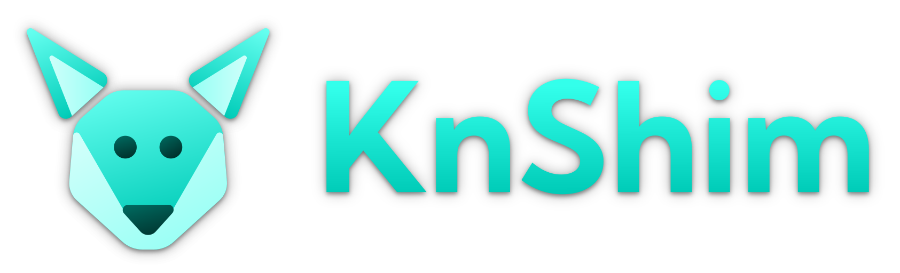

# Knot's Smash Hit Shim

A small shim that loads before Smash Hit and adds some new functionality to the game. It works similarly to a mod loader in other games. Currently, it only adds some new and powerful scripting functions, but there are plans for more things in the future. :3

## Building

Build using:

```
ndk-build
```

from the Android NDK.

Any version of the NDK not horrendously oudated should be fine. I usually build using r18.
